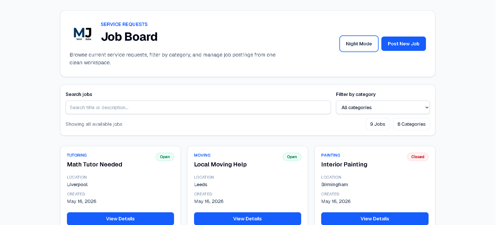
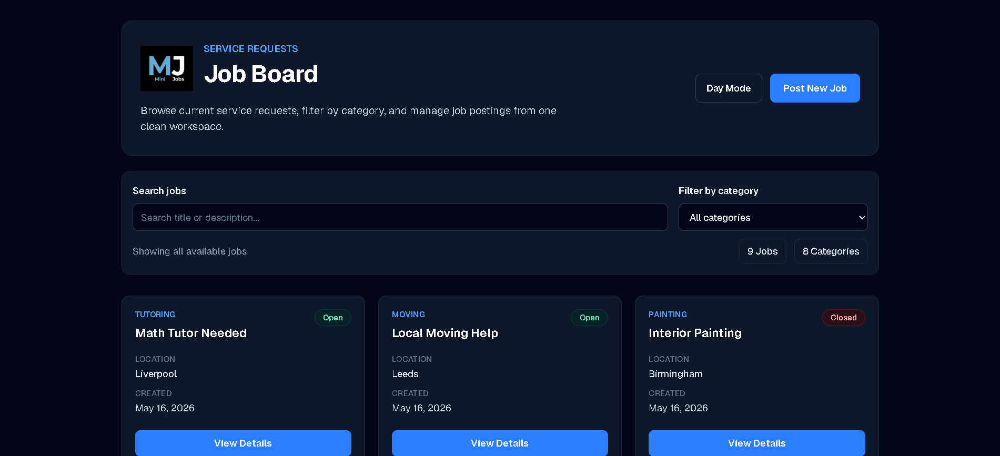
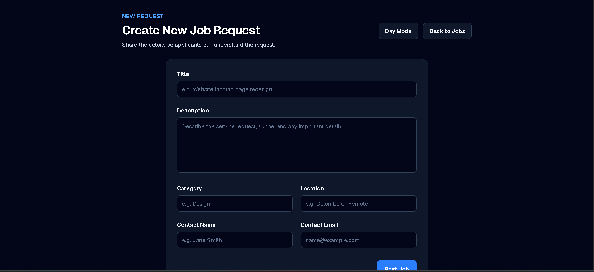
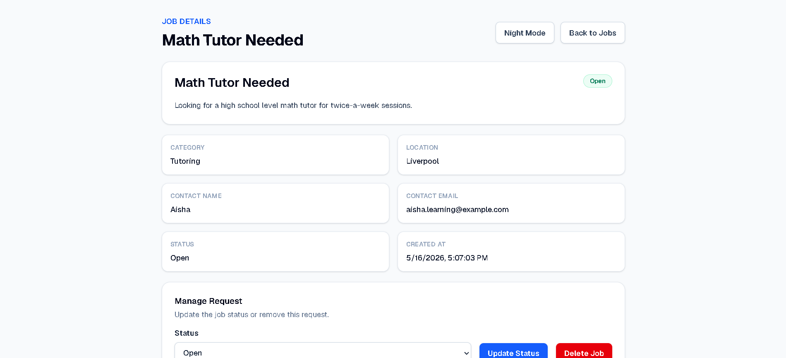

# 🚀 Mini Service Request Board

A full-stack service request management application built using modern web technologies.

This project was developed as part of a **Software Engineer Internship Assessment**, demonstrating full-stack development skills including frontend UI development, backend API creation, database integration, deployment, and production-ready application architecture.

---

## 🎥 Demo Video

[https://demo-video-link-click-here](https://drive.google.com/file/d/18Z2TQWnDjyh5eYOsYJ3DyNtnD17l969Q/view?usp=sharing)

---

## 📸 Application Screenshots

### Home Page


### Home Page


### Create Job Page


### Job Details Page


---

## 🌐 Live Deployment

### Frontend (Vercel)
mini-service-request-board-frontend-chi.vercel.app

### Backend API (Render)
https://globaltna-backend-hq7l.onrender.com

API Health Check:

```bash
https://globaltna-backend-hq7l.onrender.com
```

Response:

```json
{
  "message": "API running"
}
```

---

## 🧠 Overview

The Mini Service Request Board allows users to create and manage service requests in a clean and user-friendly interface.

Users can:

- Create new service requests
- View all available jobs
- Search jobs by title or description
- Filter jobs by category
- View complete job details
- Update request status
- Delete completed/unwanted jobs

The application was designed with a responsive modern UI and production deployment support.

---

## ✨ Key Features

- Full CRUD operations
- Create service request form
- View all job listings
- Detailed job information page
- Search functionality
- Category filtering
- Status management
- Delete confirmation
- Responsive modern UI
- Loading states
- Error handling
- Toast notifications
- Production deployment
- MongoDB cloud database integration

---

## 🛠 Tech Stack

### Frontend
- Next.js
- Tailwind CSS
- Axios
- React Hot Toast

### Backend
- Node.js
- Express.js
- MongoDB Atlas
- Mongoose
- CORS
- dotenv

### Deployment
- Vercel (Frontend)
- Render (Backend)

---

## 📁 Project Structure

```bash
globaltna-assessment/
 ├── backend/
 │   ├── config/
 │   ├── controllers/
 │   ├── middleware/
 │   ├── models/
 │   ├── routes/
 │   ├── scripts/
 │   ├── .env
 │   ├── package.json
 │   ├── package-lock.json
 │   └── server.js
 │
 ├── frontend/
 │   ├── .next/
 │   ├── assets/
 │   ├── node_modules/
 │   ├── public/
 │   ├── src/
 │   │   ├── app/
 │   │   ├── components/
 │   │   └── services/
 │   ├── package.json
 │   └── next.config.js
 │
 └── README.md
```

---

## ⚙️ Installation & Setup

Clone the repository:

```bash
git clone https://github.com/YOUR-USERNAME/YOUR-REPO-NAME.git
```

Move into project folder:

```bash
cd globaltna-assessment
```

---

## 🔧 Backend Setup

Move to backend:

```bash
cd backend
```

Install dependencies:

```bash
npm install
```

Create `.env` file:

```env
MONGO_URI=your_mongodb_atlas_connection_string
PORT=5000
NODE_ENV=development
```

Run backend:

```bash
npm run dev
```

Backend runs on:

```bash
http://localhost:5000
```

---

## 🎨 Frontend Setup

Move to frontend:

```bash
cd frontend
```

Install dependencies:

```bash
npm install
```

Run frontend:

```bash
npm run dev
```

Frontend runs on:

```bash
http://localhost:3000
```

---

## 🔌 API Endpoints

### Jobs

Get all jobs:

```http
GET /api/jobs
```

Search jobs:

```http
GET /api/jobs?search=plumber
```

Filter by category:

```http
GET /api/jobs?category=Plumbing
```

Get single job:

```http
GET /api/jobs/:id
```

Create job:

```http
POST /api/jobs
```

Update status:

```http
PATCH /api/jobs/:id
```

Delete job:

```http
DELETE /api/jobs/:id
```

---

## 📱 Responsive Design

The application is fully responsive and optimized for:

- Desktop
- Tablet
- Mobile devices

---

## 🚀 Deployment Setup

### Frontend Deployment (Vercel)

- Connect GitHub repository
- Framework preset: Next.js
- Deploy frontend project

### Backend Deployment (Render)

- Create Web Service
- Connect GitHub repository
- Root directory: backend
- Add environment variables
- Deploy Node.js backend

---

## 🧪 Testing Features

Please test:

- Create job
- Search jobs
- Filter by category
- View job details
- Update job status
- Delete job
- API connectivity

---

## ⚠ Important Note

<div style="background-color:#ff4d4f; color:white; padding:15px; border-radius:8px; font-weight:bold;">

I did NOT ignore any project files using `.gitignore` intentionally for assessment review purposes, so all required files are included for easy evaluation.

</div>

---

## 👨‍💻 Author

**Zamran Ahamed**

Software Engineer Internship Assessment Submission

---
